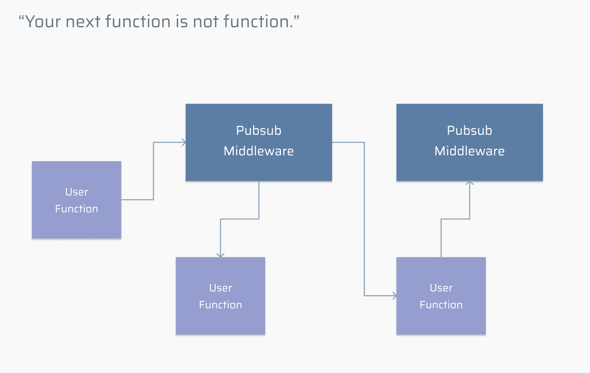
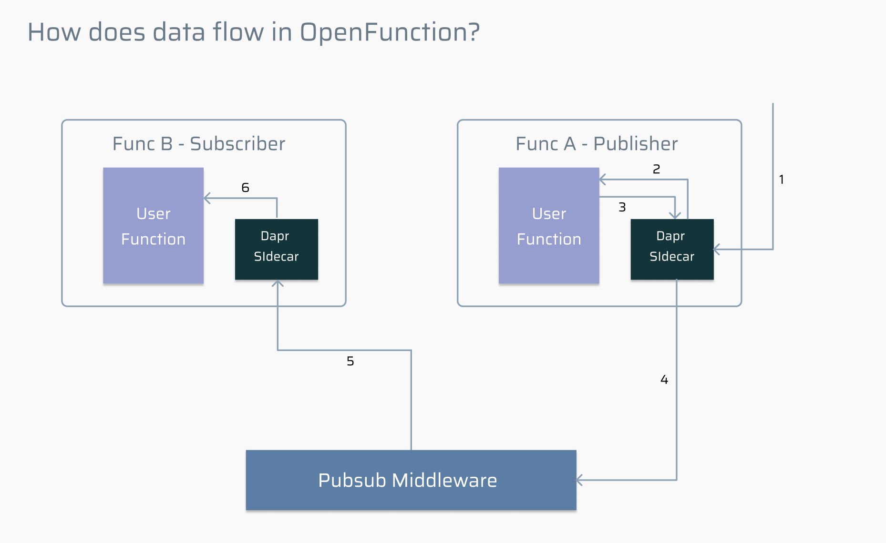

# How Does Data Flow in OpenFunction?

One heighlight of OpenFunction is that **you can communicate with not only the function itself, but also some third middlewares, which provide users greater scalability to handle their business logic**.



The above image shows a possible function composition in OpenFunction. In OpenFunction, user function can either send result to middleware or receive data from middlware.

In order to make full use of OpenFunction, we can add a `config.js` for the user function. However, you may not understand how does `config.js` work in our framework.

Here, we demonstrate an example to show the dataflow in the openfunction with the configuration:

Assume that you write two functions: Func A has a role of publisher, and Func B has a role of subscriber. To declare these two roles, you need to specify it in your `config.json`

Func B - `config.json`:

```json
{
  "input": {
    "name": "middleware",
    "uri": "test",
    "params": {
      "type": "pubsub"
    }
  }
}
```

**`input` means what type of your function is**. If you don't specify this field, our function is regarded as the normal HTTP request. Let's say thet you specify the filed is a `pubsub` (see `input.param.type` above), this means your function is now a subscriber in the OpenFunction, the pubsub middleware which the function subscribes is called `middleware` (see `input.name`) and the topic is `test` (see `input.uri`).

This means that Func B has a role of *<u>subscriber</u>*, the pubsub middleware is called "middleware" and the topic that Func B subscribes is called "test".

Func A - `config.json`

```json
{
  "outputs": {
    "middleware": {
      "uri": "test",
      "params": {
        "type": "pubsub"
      }
    }
  }
}
```

**`outputs` means the destinations your function result goes to**. If you don't specify this field, the result just returns to the caller. Here let's say we want to send the result to `middleware` middlware component (see `outputs.middleware`), it's type is a `pubsub` (see `outputs.pubsub.params.type`), this means that your function is now a publisher, and you publish your result to the middleware component called `pubsub`.

`outputs` is a map data structure, as you can declare many output middleware.  Here pubsub middleware is called "middleware" and the topic that Func A <u>published</u> is called "test".

> ⚠️ To understand all details of `config.json`, please read [OpenFunction Context Specs](https://github.com/OpenFunction/functions-framework/blob/main/docs/OpenFunction-context-specs.md).

Now let's see how does data flow in OpenFunction:



Note that now we take advantage of [dapr](https://www.dapr.io), so the graph above has a dapr sidecar.

1. Someone trigger the Func A and the data is blocked in the Dapr sidecar first;
2. Dapr sidecar forwards the data to the user function and does the business logic;
3. Function A calculates the result and publishes the result, again, it is blocked in the Dapr sidecar;
4. Because we have configured component in dapr, so the dapr sidecar sends the data to the pubsub middleware;
5. Pubsub middleware gets the data and publishes to the Func B;
6. Dapr sidecar gets the data from middleware and sends it to func B to do the subsequent business logic.